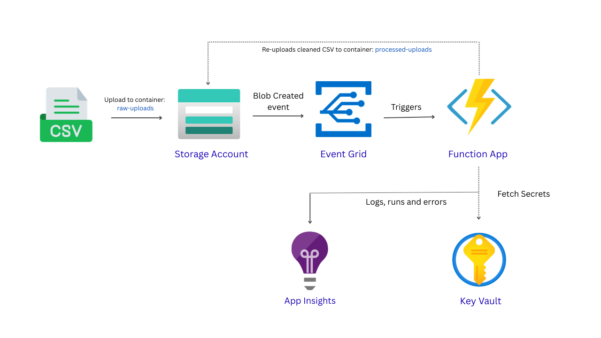

# Build a Serverless CSV Cleaning Pipeline with Azure Functions

> Automatically clean CSV files using Azure Functions, Event Grid, Key Vault and App Insights. Drop a messy CSV into storage and get a clean version back within seconds, no manual work needed. Full step-by-step Azure Portal setup guide: [Read the blog post](https://palak-bhawsar.hashnode.dev/build-a-serverless-csv-cleaning-pipeline-with-azure-functions)
---

## Architecture Diagrams




## Prerequisites

Before setting up locally make sure you have:

- Python 3.11
- VS Code with the Azure Functions extension
- Azure Functions Core Tools
- An Azure account with the resources listed above already created

## Local Environment Setup

### 1. Clone the repository

```bash
git clone https://github.com/palakbhawsar98/csv-processor.git
cd csv-processor
```

### 2. Create a virtual environment

```bash
python -m venv .venv
```

### 3. Activate the virtual environment

```bash
.venv\Scripts\activate
```

You should see `(.venv)` appear at the start of your terminal line.

### 4. Install dependencies

```bash
pip install -r requirements.txt
```

### 5. Set up local settings

Create a `local.settings.json` file in the root of the project:

```json
{
  "IsEncrypted": false,
  "Values": {
    "AzureWebJobsStorage": "YOUR-STORAGE-ACCOUNT-CONNECTION-STRING",
    "FUNCTIONS_WORKER_RUNTIME": "python",
    "KEY_VAULT_URL": "https://kv-csvprocessor-01.vault.azure.net/"
  }
}
```

To get your storage connection string:
1. Go to `stcsvprocessor01` in Azure Portal
2. Click **Access keys** → click **Show** next to key1
3. Copy the full **Connection string** and paste it above

> `local.settings.json` is already in `.gitignore` — it will never be pushed to GitHub


## Deploy to Azure from VS Code

### Using the Command Palette

1. Open VS Code
2. Press `Ctrl + Shift + P`
3. Type `Azure Functions: Deploy to Function App`
4. Select your subscription
5. Select `func-csv-processor`
6. Click **Deploy** on the confirmation dialog

> Deployment takes 1-2 minutes. You will see a progress notification in the bottom right corner of VS Code.


## Testing the Pipeline

### 1. Create a test CSV file

Open Notepad and paste the following, then save as `test.csv`:

```
name,age,salary
John,30,50000
Jane,25,45000
,,,
Mike,28,-1000
Sarah,32,60000
```

This file has 3 valid rows, 1 blank row, and 1 row with a negative value.

### 2. Upload to Azure Storage

1. Go to `stcsvprocessor01` → **Containers** → `raw-uploads`
2. Click **Upload** → select `test.csv` → click **Upload**

### 3. Check the output

Wait 30 seconds then go to `processed-uploads` — you should see a new file like:

```
test_20260315_154724_cleaned.csv
```

Download and open it — it should contain only the 3 valid rows.

### 4. Check the logs

Go to `func-csv-processor` → **Functions** → `CsvCleanProcessor` → **Invocations**

You should see a successful invocation. Click on it to see the full log output:

```
Processing: test.csv
File: test.csv | Total: 5 | Cleaned: 3 | Skipped: 2
Done — written to processed-uploads/test_20260315_154724_cleaned.csv
```


## Monitoring

All function runs are logged to App Insights. To query logs:

1. Go to `appi-csv-processor` → **Logs**
2. Run this query:

```kusto
traces
| order by timestamp desc
| take 20
```


## What the cleaning does

| Rule | Action |
|---|---|
| Blank rows | Removed |
| Rows with negative numbers | Skipped |
| Extra whitespace in cells | Stripped |
| Non-CSV files | Ignored with a warning log |


